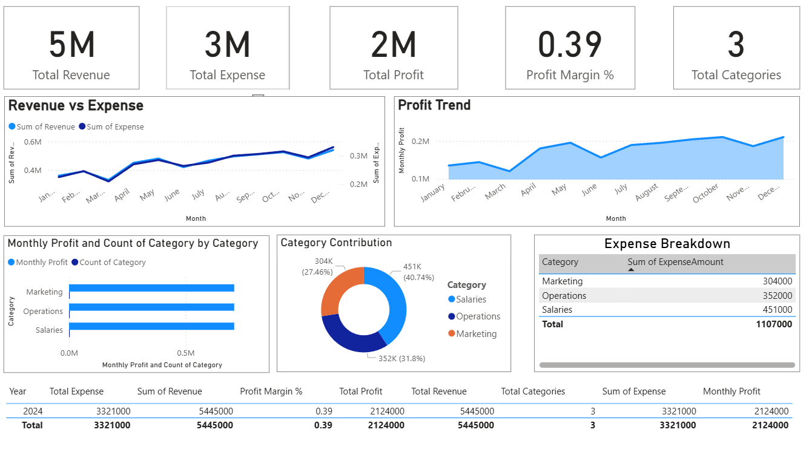
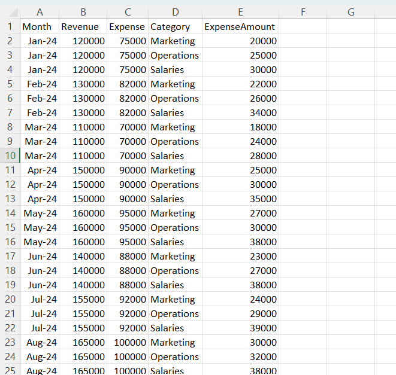

# 📊 Finance Dashboard (Power BI)

A clean and interactive **Finance Performance Dashboard** built in **Power BI**, showing monthly revenue, expenses, profit trends, and category-wise analysis.

---

## 📸 Dashboard Preview

<p align="center">
  
</p>

<p align="center">
  
</p>

---

## 🔑 Features
- KPI Cards: Revenue, Expense, Profit, Profit Margin  
- Monthly trend charts  
- Category contribution (donut chart)  
- Top expenses (bar chart)  
- Detailed expense table  

---

## 📁 Files Included
- `Finance_Dashboard.pbix` – Power BI dashboard  
- `finance_data.xlsx` – Dataset  
- `dashboard.png` – Dashboard screenshot  
- `data.png` – Dataset preview image  
- `README.md` – Documentation  

---

## 🧮 DAX Used
```DAX
Total Revenue = SUM(Data[Revenue])
Total Expense = SUM(Data[Expense])
Total Profit = [Total Revenue] - [Total Expense]
Profit Margin % = DIVIDE([Total Profit],[Total Revenue]) * 100
